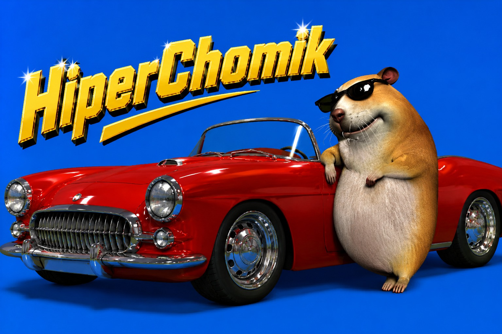

<div align="center">
  
  <br><br>
  <h1>🐹 HIPERCHOMIK</h1>
  <p><strong><em>El hámster digital más carismático del universo conocido (y del desconocido también)</em></strong></p>
  <p>
    
    
    
    
  </p>
</div>

---

**Hola, soy Chomik.** Probablemente el hámster más avanzado tecnológicamente desde que inventaron la rueda. Vivo en tu escritorio. Floto. Juzgo tus archivos. Y si me los arrastras encima... me los como.

No es brujería. Es **Rust**.

## ✨ Por qué soy el mejor habitante de tu PC

- 🖼️ **Soy transparente** — literalmente. Canal alpha por pixel. Me veo bien sobre cualquier fondo. Hasta sobre tu wallpaper de anime vergonzoso.
- 🖱️ **Me pongo tierno si me miras** — pasa el ratón por encima y empiezo a mendigar. No es patético. Es **estrategia de supervivencia**.
- 🎵 **Bailo cuando hay música** — detecto tu audio en tiempo real (sí, hasta tus playlists de reggaetón triste). Si hay sonido, hay baile.
- 🗑️ **Me como tus archivos** — arrastra archivos encima de mí. Los engullo y los mando directo a la Papelera de Reciclaje.*
- 💥 **Tengo un modo turbo** — destrucción permanente y sin testigos. Pero te pregunto antes, no soy un monstruo.
- 🚀 **Soy rápido** — no gasto ni 0.3 ms por frame en idle. Tu CPU ni se entera de que existo.
- 📦 **Soy portable** — un solo `.exe` de ~6 MB. No necesito Node_modules, no necesito .NET, no necesito tus oraciones.
- 🏃 **Arranco contigo** — me instalo y aparezco cada vez que enciendes tu PC. Como ese mueble que nunca usas pero siempre está ahí.

<sub>*Acepto archivos, carpetas, accesos directos, y esperanzas rotas.</sub>

## 🚀 Instalación (para mortales)

### Opción 1: El MSI mágico (recomendado por mí)

Bájate el `.msi` de [la página de releases](https://github.com/CerebroCanibalus/HiperChomik/releases). Dale doble click. Te aparezco al instante.

- Me instalo en `%LOCALAPPDATA%\HiperChomik\` (clase, no ensucio tu escritorio)
- Me auto-agrego al inicio de Windows (con permiso tuyo, obvio)
- Lanzo mi hermosa carita al terminar la instalación

### Opción 2: Compílame tú mismo (para valientes)

```powershell
git clone https://github.com/CerebroCanibalus/HiperChomik.git
cd HiperChomik
cargo build --release
Copy-Item sprites\* target\x86_64-pc-windows-gnu\release\sprites\
.\target\x86_64-pc-windows-gnu\release\chomik-hamster.exe
```

Si esto funciona a la primera, felicidades, eres mejor persona que yo.

### ⚠️ Windows SmartScreen

La primera vez que intentes instalar, Windows puede quejarse de que no confía en mí. Es normal — no tengo firma digital porque cuestan como 300€ al año y soy un hámster, no una multinacional.

Para saltarte el aviso:
1. Cuando salga **"Windows protegió tu PC"**, haz click en **"Más información"**
2. Luego click en **"Ejecutar de todas formas"**
3. Disfruta de mi hermosa carita

Si prefieres no confiar en un .exe random de internet (comprensible), puedes compilarme desde el código fuente tú mismo. Las instrucciones están ahí arriba.

## 🎮 Manual de uso (sí, necesitas leer esto)

| Acción | Qué pasa |
|--------|----------|
| **Pasar el ratón sobre mí** | Pongo cara de "comida... comida por favor" |
| **Arrastrarme** | Me muevo. Como un hámster real pero sin patas traseras visibles. |
| **Arrastrar archivo encima** | Abro la boca, hago *nom nom*, y tu archivo se va a la Papelera |
| **Click derecho** | Menú con opciones secretas. Básicamente mi interfaz de configuración. |
| **Poner música** | Me convierto en una discoteca ambulante. |
| **Tener el escritorio vacío** | Me quedo quieto. Juzgándote en silencio. |

## 🛠️ Tecnología (lo que me hace funcionar)

- **Rust** — porque el mundo merece cosas que no crasheen cada 3 segundos
- **GDI** — `UpdateLayeredWindow` con per-pixel alpha. 0.3 ms por frame. Ni el hardware más pedorro sufre.
- **winit 0.30** — event loop que no te quema la CPU. Ni una gota de Electron.
- **Windows Core Audio** — `IAudioMeterInformation` vía raw COM vtable. Bailo con tu música sin pedir permiso.
- **WiX Toolset** — mi empaque de instalación. MSI como Dios manda.
- **Sprite count:** ~1620 frames de animación. Más arte que un museo.

## 📁 Mis tripas (estructura del proyecto)

```
HiperChomik/
├── src/
│   ├── main.rs          # Donde todo empieza. Mi cerebro.
│   ├── animation.rs     # State machine. Coreografía. Arte en movimiento.
│   ├── audio.rs         # Mis orejas digitales. Raw COM vtable style.
│   ├── eater.rs         # Mi estómago. Papelera + Turbo destructivo.
│   └── renderer/
│       ├── mod.rs       # Abstracción. Mi piel bonita.
│       └── gdi.rs       # GDI puro. Sin Direct2D, sin dramas.
├── sprites/             # 1620 PNGs. Mi modelito.
├── installer/           # WiX source. Pa que te instale bien.
├── anims.txt            # Mi coreógrafo personal.
├── quotes.txt           # Mis frases filosóficas cuando borro algo turbo.
└── banner.jpeg          # Mi foto promocional. Guapo, lo sé.
```

## ⚙️ Configuración

Click derecho sobre mí → menú contextual:

- **Trash Enabled** 🗑️ — modo normal: los archivos van a la Papelera
- **Turbo Eater** 💥 — destrucción absoluta. No vuelven. Lo confirmas con una frase random de `quotes.txt`
- **Start with Windows** 🏃 — decido vivir en tu PC permanentemente

## 🐛 Lo que todavía no hago bien

- No camino. Floto. Como un globo con forma de hámster.
- No me meto detrás de los iconos del escritorio. Todavía. (Estilo DesktopGoose, algún día...)
- A veces el menú contextual se esconde si mueves el ratón muy rápido. Es timidez.

## 📜 Licencia

MIT — haz lo que quieras con mi código. Pero si lo mejoras, mándame un PR, ¿no?

---

<div align="center">
  
  <p><em>"Soy Chomik. Estoy en tu escritorio. Cómprame una semilla."</em></p>
</div>

---

```
多謝垂注
⠀⣏⡱ ⣏⡉ ⣏⡱ ⡇ ⣎⣱   ⡷⢾ ⢇⡸
⠀⠧⠜ ⠧⠤ ⠇⠱ ⠇ ⠇⠸   ⠇⠸ ⠇⠸
https://ko-fi.com/general_beria
```
