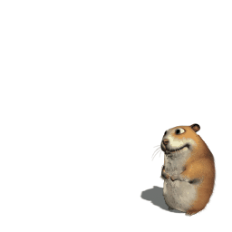

<div align="center">
  
  <h1>🐹 HiperChomik</h1>
  <p><strong>Desktop hamster pet — transparente, interactivo, y hambriento</strong></p>
  <p>
    
    
    
  </p>
</div>

---

## 🎯 ¿Qué es?

Un hámster de escritorio que flota sobre tus ventanas. Se mueve, reacciona al ratón, detecta música y **come archivos** mandándolos a la Papelera de Reciclaje.

Inspirado en Desktop Goose y Shimeji.

## ✨ Características

- 🖼️ **Transparente** — per-pixel alpha, se ve sobre cualquier fondo
- 🖱️ **Interactivo** — hover para que mendigue, drag para moverlo
- 🎵 **Reacciona a la música** — baila cuando detecta audio activo
- 🗑️ **Come archivos** — arrastra archivos encima y los manda a la papelera
- 💥 **Turbo Eater** — borrado permanente (con confirmación)
- 🖥️ **Arranque automático** — se inicia con Windows
- 📦 **Sin dependencias** — portable, un solo .exe

## 🚀 Instalación

### Opción 1: MSI Installer (recomendado)

Descarga el `.msi` de la [página de releases](https://github.com/CerebroCanibalus/HiperChomik/releases) y ejecútalo.

- Instala en `%LOCALAPPDATA%\HiperChomik\`
- Añade entrada de autostart en registro
- Se lanza automáticamente al finalizar

### Opción 2: Manual

```powershell
git clone https://github.com/CerebroCanibalus/HiperChomik.git
cd HiperChomik
cargo build --release
Copy-Item sprites\* target\x86_64-pc-windows-gnu\release\sprites\
.\target\x86_64-pc-windows-gnu\release\chomik-hamster.exe
```

## 🎮 Cómo usar

| Acción | Resultado |
|--------|-----------|
| **Mover ratón sobre el hámster** | Mendiga y te sigue con la mirada |
| **Arrastrar archivo encima** | Abre la boca y lo come → Papelera |
| **Click derecho** | Menú contextual |
| **Reproducir música** | Empieza a bailar |
| **Arrastrar ventana** | Mueve el hámster por la pantalla |

## 🛠️ Tecnologías

- **Rust** — rendimiento nativo, ~6 MB, ~35 MB RAM
- **GDI** — `UpdateLayeredWindow` para renderizado con canal alpha
- **winit 0.30** — event loop eficiente (0.3 ms/frame en idle)
- **Windows Core Audio** — detección de música via `IAudioMeterInformation`
- **WiX Toolset** — instalador MSI

## 📁 Estructura

```
HiperChomik/
├── src/
│   ├── main.rs          # Entry point, event loop, window events
│   ├── animation.rs     # State machine de animaciones
│   ├── audio.rs         # Detección de audio (raw COM)
│   ├── eater.rs         # File eater (papelera + turbo)
│   └── renderer/
│       ├── mod.rs       # GDI render wrapper
│       └── gdi.rs       # UpdateLayeredWindow implementation
├── sprites/             # ~1620 PNG frames (256×256 RGBA)
├── installer/           # WiX MSI project
├── anims.txt            # Definiciones de animaciones
├── quotes.txt           # Mensajes para Turbo Eater
└── build.bat            # Build + deploy script
```

## ⚙️ Configuración

El menú contextual (click derecho) permite:

- **Trash Enabled** — activar/desactivar modo papelera
- **Turbo Eater** — borrado permanente (sin papelera)
- **Start with Windows** — autostart toggle

## 🐛 Bugs conocidos

- El hámster flota en su lugar (sin desplazamiento automático)
- Sin integración de escritorio (detrás de iconos tipo DesktopGoose)

## 📜 Licencia

MIT
